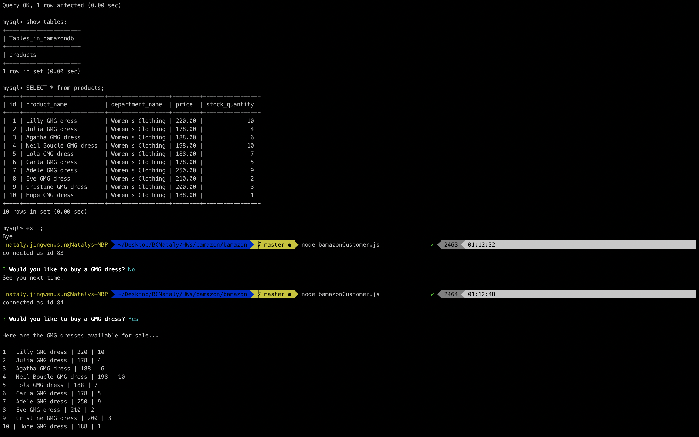
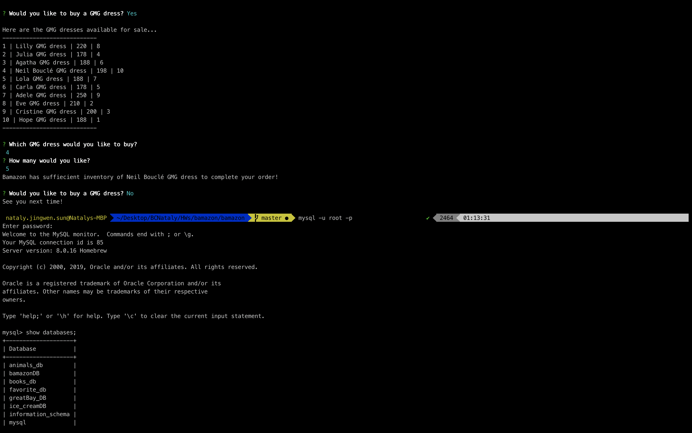

# bamazon

* * * Bamazon is an Amazon-like storefront with the MySQL database. The app will take in orders from customers and deplete stock from the store's inventory. 

Customer View

  * * * receive user input using the `inquirer` npm package.
  
  
  
  JavaScript, NodeJS, 
  NPMs: inquirer & MySQL
  
  
  
  **Install MySQL
  **Install Inquirer
  **Change password to your password
  
  
   
   
   
   
